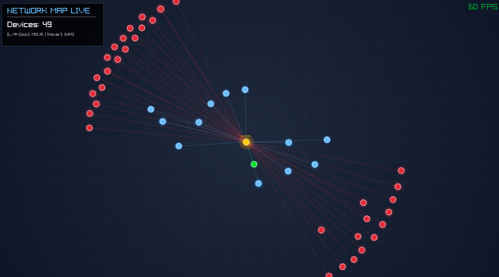

# Network Map Live

A real-time, visual network scanner and mapper application built in C using [Raylib](https://www.raylib.com/).
It automatically scans your local network, discovers devices/hosts, and visualizes them in a dynamic, physics-based graph.



## Features

### 🔍 Live Network Discovery
- **Continuous Scanning**: Automatically discovers new devices and updates the status of existing ones.
- **Disconnection Detection**: Devices that stop responding fade out and are marked as "Inactive".
- **Dynamic Threading**: Adjust the scanning speed in real-time via the GUI or on startup via CLI.

### 🎨 Visualizations
- **Physics-Based Layout**: Nodes self-organize around a central gateway.
- **Latency Indicators**:
  - Distance from Gateway correlates to Ping/RTT.
  - Link colors indicate connection quality (Green < 5ms, Blue < 100ms, Red > 100ms).

### 🛠️ Advanced Tools (Ethical Hacking)
> [!WARNING]
> This tool includes features for **ARP Poisoning** and **DNS Spoofing**. Use these features **ONLY** on networks you own or have explicit permission to audit. Unauthorized network manipulation is illegal.

- **DNS Spoofing & ARP Poisoning**:
    - Select any target device (except Gateway).
    - Redirect DNS queries for specific domains (e.g. `google.com`) to a custom IP address.
    - Real-time attack status visualization (Target turns **PURPLE**).

### 🏷️ Identification
- **Name Resolution**: DNS (Reverse Lookup) & NetBIOS (`nmblookup`).
- **OUI Lookup**: Automatic MAC Vendor identification.

## Requirements

The application runs on Linux. It requires root privileges (`sudo`) to use Raw Sockets for ICMP scanning and ARP manipulation.

### Dependencies (Debian/Ubuntu)

```bash
sudo apt update
sudo apt install build-essential git samba-common-bin \
    libasound2-dev libx11-dev libxrandr-dev libxi-dev \
    libgl1-mesa-dev libglu1-mesa-dev libxcursor-dev \
    libxinerama-dev libwayland-dev libxkbcommon-dev
```

## Installation

1. **Clone the repository**:
   ```bash
   git clone https://github.com/yourusername/network-map.git
   cd network-map
   ```

2.  **Compile**:
    ```bash
    make
    ```

## Usage

Run the application with `sudo`:

```bash
# Default (50 threads)
sudo ./bin/network-map

# Custom thread count (e.g. 100 threads for faster scanning)
sudo ./bin/network-map -t 100
```

### Controls

| Action | Result |
| :--- | :--- |
| **Left Click (Node)** | Open **DNS Spoofing Panel** (Select Target). |
| **Left Click (Gateway)** | Locked (Cannot be spoofed). |
| **Left/Right Drag** | Pan the camera. |
| **Mouse Wheel** | Zoom In/Out. |
| **HUD [+] / [-]** | Increase/Decrease scanning threads in real-time. |
| **ESC** | Exit the application. |

## Troubleshooting

-   **Freeze/Crash on Startup?** Ensure you are running with `sudo`.
-   **No Hostnames?** Some devices firewall ICMP/NetBIOS.
-   **Spoofing Not Working?** Ensure IP Forwarding is enabled on your machine (`sysctl -w net.ipv4.ip_forward=1` is usually handled, but good to check).
